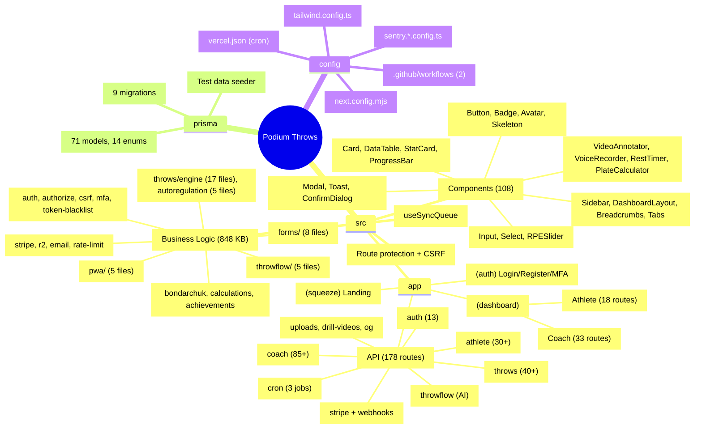
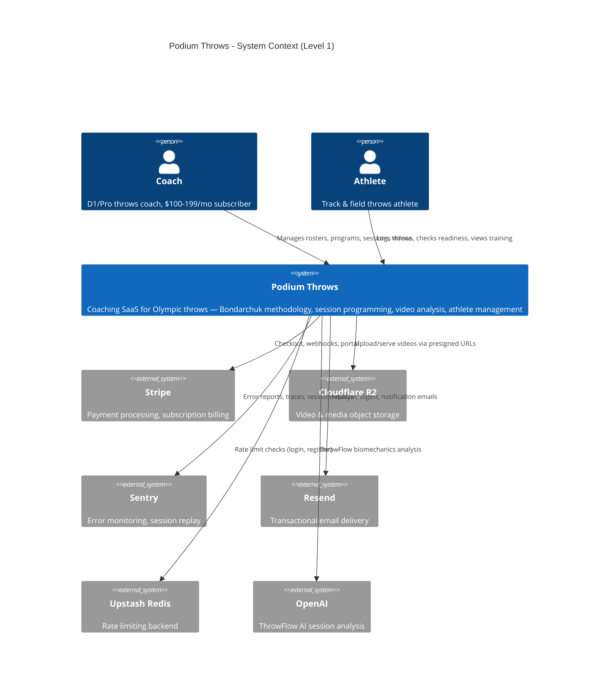
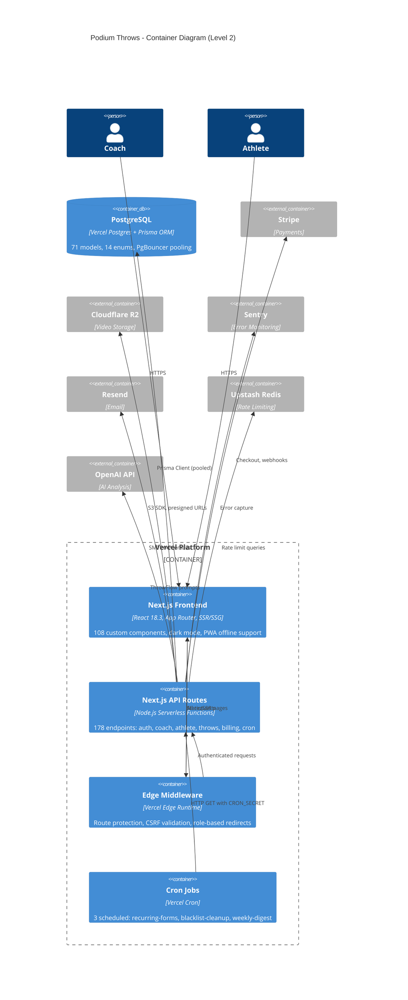
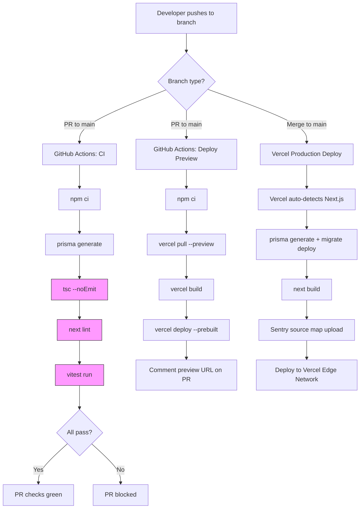

# Project Architecture -- Podium Throws (Last Updated: 2026-03-18)

## Executive Summary

- **Core value proposition**: Subscription coaching SaaS for elite Olympic-level track & field throws coaches, implementing Dr. Anatoliy Bondarchuk's Transfer of Training methodology -- the only platform that enforces correct implement sequencing and periodization science at the software level.
- **Growth stage**: Early-revenue B2B SaaS targeting Division I and professional throws coaches at $100-199/month per coach (FREE/PRO/ELITE tiers via Stripe). Competing against BridgeAthletic, TrainHeroic, TeamBuildr, CoachMePlus.
- **Primary technical risk**: Custom JWT auth without refresh token rotation creates a 7-day window of exposure if a token is compromised. Mitigation: token blacklist on logout + CSRF double-submit cookies + rate limiting via Upstash Redis.
- **AI acceleration score: 4/10** -- ThrowFlow (OpenAI-powered session analysis) is the only AI feature. Significant opportunity to expand AI into program generation, video biomechanics, and coaching insights.

---

## 1. PROJECT STRUCTURE

```
Podium Throws/
|
+-- .github/workflows/          # CI/CD
|   +-- ci.yml                  # PR checks: typecheck + lint + test
|   +-- deploy-preview.yml      # Preview deploys via Vercel CLI
|
+-- prisma/
|   +-- schema.prisma           # 2,407 lines | 71 models | 14 enums
|   +-- seed.ts                 # 919 lines | test data seeder
|   +-- migrations/             # 9 migration files
|
+-- public/
|   +-- uploads/                # Local dev upload storage
|   +-- sw.js                   # Service worker (PWA offline)
|
+-- remotion/                   # Video generation (onboarding demos)
|
+-- src/
|   +-- app/
|   |   +-- (auth)/             # Login, register, MFA, password reset
|   |   +-- (dashboard)/
|   |   |   +-- coach/          # 33 route groups (roster, plans, throws, sessions, videos, settings, etc.)
|   |   |   +-- athlete/        # 18 route groups (dashboard, sessions, throws, wellness, goals, etc.)
|   |   +-- (squeeze)/          # Landing/marketing pages
|   |   +-- api/                # 178 API route handlers
|   |   |   +-- auth/           # 13 auth endpoints (login, register, MFA, password reset)
|   |   |   +-- coach/          # 85+ coach endpoints
|   |   |   +-- athlete/        # 30+ athlete endpoints
|   |   |   +-- throws/         # 40+ throws domain endpoints
|   |   |   +-- stripe/         # Checkout, portal
|   |   |   +-- webhooks/       # Stripe webhook handler
|   |   |   +-- cron/           # 3 scheduled jobs
|   |   |   +-- throwflow/      # AI session analysis
|   |   |   +-- uploads/        # File upload handlers
|   |   |   +-- drill-videos/   # Video library CRUD
|   |   |   +-- og/             # Dynamic OG image generation
|   |   |   +-- ...             # invitations, teams, readiness, goals, lifting, etc.
|   |   +-- layout.tsx          # Root layout (fonts, providers, analytics)
|   |   +-- globals.css         # Tailwind + CSS variables + dark mode
|   |   +-- sitemap.ts          # Dynamic sitemap generation
|   |   +-- error.tsx           # Error boundary
|   |   +-- global-error.tsx    # Global error boundary (Sentry)
|   |
|   +-- components/             # 108 custom UI components (1.2 MB)
|   |   +-- Button, Card, Modal, Badge, Avatar, Input, Select
|   |   +-- RPESlider, PlateCalculator, RestTimer
|   |   +-- VideoAnnotator, VoiceRecorder, VoicePlayer
|   |   +-- Skeleton, Toast, ConfirmDialog, UpgradeModal
|   |   +-- Sidebar, DashboardLayout, EmptyState, Breadcrumbs
|   |   +-- DataTable, StatCard, ScoreIndicator, ProgressBar, Tabs
|   |   +-- index.ts            # Barrel export
|   |
|   +-- hooks/
|   |   +-- useSyncQueue.ts     # Offline sync queue hook
|   |
|   +-- lib/                    # Business logic (848 KB)
|   |   +-- auth.ts             # JWT generation, getSession(), getCurrentUser()
|   |   +-- auth-edge.ts        # Edge-safe token decode (middleware)
|   |   +-- authorize.ts        # canAccessAthlete(), canAccessSession(), etc.
|   |   +-- bondarchuk.ts       # Transfer of Training calculations
|   |   +-- calculations.ts     # RPE, e1RM, volume calculations
|   |   +-- stripe.ts           # Stripe client + plan definitions
|   |   +-- r2.ts               # Cloudflare R2 integration
|   |   +-- email.ts            # Resend + SMTP fallback
|   |   +-- rate-limit.ts       # Upstash Redis rate limiter
|   |   +-- csrf.ts             # CSRF double-submit cookie
|   |   +-- mfa.ts              # TOTP/HOTP + backup codes
|   |   +-- token-blacklist.ts  # JWT revocation store
|   |   +-- audit.ts            # Audit log writer
|   |   +-- logger.ts           # Structured logging
|   |   +-- prisma.ts           # Prisma singleton
|   |   +-- notifications.ts    # Push/email notification dispatch
|   |   +-- achievements.ts     # Achievement awarding logic
|   |   +-- activity-log.ts     # User activity tracking
|   |   +-- api-schemas.ts      # Zod validation schemas
|   |   +-- design-tokens.ts    # Color/spacing constants
|   |   +-- storage.ts          # Generic storage abstraction
|   |   +-- workspaces.ts       # Workspace management
|   |   +-- muscle-visualizer.ts
|   |   +-- data/               # Data loader functions
|   |   |   +-- athlete.ts
|   |   |   +-- coach.ts
|   |   |   +-- throws.ts
|   |   +-- forms/              # Questionnaire engine (8 files)
|   |   |   +-- answer-piping.ts, block-registry.ts, conditional-engine.ts
|   |   |   +-- scoring-engine.ts, recurring-scheduler.ts, validation.ts
|   |   +-- throws/             # Bondarchuk implementation core
|   |   |   +-- engine/         # Program generation (17 files)
|   |   |   |   +-- generate-program.ts, generate-session.ts, generate-phase.ts
|   |   |   |   +-- generate-week.ts, select-implements.ts, select-exercises.ts
|   |   |   |   +-- adaptive-waves.ts, contrast-patterns.ts, elite-taper.ts
|   |   |   |   +-- complex-manager.ts, feedback-loop.ts, personal-correlations.ts
|   |   |   |   +-- scale-volume.ts, adaptation-checker.ts, validate-program-output.ts
|   |   |   |   +-- onboarding-validator.ts, select-strength.ts
|   |   |   +-- autoregulation/  # Adaptive session adjustments (5 files)
|   |   |   +-- podium-profile.ts, profile-constants.ts, profile-utils.ts
|   |   |   +-- validation.ts, constants.ts, correlations.ts
|   |   +-- throwflow/          # AI session analysis (5 files)
|   |   |   +-- prompt-builder.ts, frame-extraction.ts
|   |   |   +-- reference-data.ts, schemas.ts, types.ts
|   |   +-- lifting-templates/
|   |   |   +-- tissue-remodeling.ts
|   |   +-- pwa/                # Progressive Web App (5 files)
|   |       +-- idb.ts, sync-queue.ts, video-cache.ts
|   |       +-- online-status.ts, register-sw.ts
|   |
|   +-- middleware.ts           # Route protection + CSRF validation
|   +-- instrumentation.ts     # Sentry initialization
|   +-- __tests__/setup.ts     # Vitest setup
|
+-- sentry.client.config.ts    # Client Sentry (replay, 10% traces)
+-- sentry.server.config.ts    # Server Sentry (10% traces)
+-- next.config.mjs            # Next.js config (CSP, headers, Sentry)
+-- tailwind.config.ts         # Custom design system
+-- vitest.config.ts           # Unit test config (jsdom)
+-- vercel.json                # Cron jobs (3 scheduled tasks)
+-- package.json               # 46 prod + 30 dev dependencies
+-- tsconfig.json              # Strict mode, path aliases
```

<details>
<summary>Mermaid Mindmap (click to expand)</summary>


</details>

---

## 2. HIGH-LEVEL SYSTEM DIAGRAM

### Level 1: Context Diagram



### Level 2: Container Diagram



---

## 3. CORE COMPONENTS

### 3.1 Next.js Frontend

| Property | Value |
|---|---|
| **Purpose** | Server-rendered coaching dashboard with PWA offline support |
| **Tech Stack** | Next.js 14.2.35, React 18.3, TypeScript 5.9.3, Tailwind CSS 3.4.1 |
| **Entry Point** | `src/app/layout.tsx` |
| **Deployment Target** | Vercel (automatic from `main` branch) |
| **Scaling Strategy** | Vercel serverless — auto-scales per request, edge CDN for static assets |
| **Bundle Size** | Shared JS: 199 kB, heaviest page: 349 kB (`/coach/throws/profile`) |
| **Key Patterns** | Server Components by default, `'use client'` pushed to leaf nodes (224 client components), dark mode via `class` strategy, Outfit/DM Sans fonts |

### 3.2 API Layer (Serverless Functions)

| Property | Value |
|---|---|
| **Purpose** | RESTful API serving coach, athlete, throws, billing, and admin operations |
| **Tech Stack** | Next.js Route Handlers, Prisma ORM 5.22.0, Zod 4.3.6 validation |
| **Entry Point** | `src/app/api/` (178 route handlers) |
| **Deployment Target** | Vercel Serverless Functions (Node.js runtime) |
| **Scaling Strategy** | Per-invocation serverless, PgBouncer connection pooling |
| **Auth Pattern** | `getSession()` → JWT verify → blacklist check → role authorization |

### 3.3 Edge Middleware

| Property | Value |
|---|---|
| **Purpose** | Request interception for auth redirects, CSRF validation, role enforcement |
| **Tech Stack** | Vercel Edge Runtime (V8 isolates), custom JWT decoder |
| **Entry Point** | `src/middleware.ts` |
| **Deployment Target** | Vercel Edge Network (global, <1ms cold start) |
| **Key Limitation** | Cannot verify JWT signatures (no Node.js crypto) — decode-only, full verification in API layer |

### 3.4 Cron Jobs

| Property | Value |
|---|---|
| **Purpose** | Scheduled background tasks for data hygiene and engagement |
| **Tech Stack** | Vercel Cron → HTTP GET to API routes, `CRON_SECRET` bearer auth |
| **Entry Point** | `vercel.json` cron configuration |
| **Schedule** | `recurring-forms` (6 AM daily), `cleanup-blacklist` (midnight daily), `weekly-digest` (8 AM Sunday) |

### 3.5 Custom Component Library

| Property | Value |
|---|---|
| **Purpose** | Bespoke UI system designed for elite coaching workflows |
| **Tech Stack** | React 18.3, Tailwind CSS 3.4, Framer Motion 12.34, Lucide React icons |
| **Entry Point** | `src/components/index.ts` (barrel export) |
| **Component Count** | 108 components across 6 categories |
| **Key Constraint** | NO external UI libraries (no shadcn, Material UI, Chakra). All custom-built. |
| **Design Tokens** | Warm amber/gold primary, Outfit headings, DM Sans body, dark mode default |
| **Animations** | 25 custom Tailwind animations (spring-in, shimmer, holographic, draw-in, etc.) |

### 3.6 Throws Domain Engine

| Property | Value |
|---|---|
| **Purpose** | Bondarchuk Transfer of Training program generation and autoregulation |
| **Tech Stack** | Pure TypeScript, algorithmic periodization |
| **Entry Point** | `src/lib/throws/engine/generate-program.ts` |
| **Key Files** | 17 engine files + 5 autoregulation files + validation, constants, correlations |
| **Domain Rules** | DESCENDING implement weight sequences ONLY, 15-20% weight differential flagging, no consecutive throwing blocks |

### 3.7 ThrowFlow AI (Session Analysis)

| Property | Value |
|---|---|
| **Purpose** | AI-powered biomechanics analysis of throwing sessions |
| **Tech Stack** | OpenAI API, custom prompt builder, Zod schemas |
| **Entry Point** | `src/app/api/throwflow/route.ts` |
| **Key Files** | `src/lib/throwflow/` (5 files: prompt-builder, frame-extraction, reference-data, schemas, types) |
| **AI Model** | Configurable via `THROWFLOW_MODEL` env var |

---

## 4. DATA STORES & PERSISTENCE

| Name | Type | Purpose | Schema Highlights | Replication | Backup Policy |
|---|---|---|---|---|---|
| **Vercel Postgres** | PostgreSQL (managed) | Primary relational data store | 71 models, 14 enums, cascading deletes, composite indexes | PgBouncer connection pooling (`POSTGRES_PRISMA_URL`), direct connection for migrations (`POSTGRES_URL_NON_POOLING`) | Vercel-managed automatic backups |
| **Cloudflare R2** | S3-compatible object store | Video files, drill recordings, profile images | Bucket: `R2_BUCKET_NAME`, public URL: `R2_PUBLIC_URL` | Cloudflare global CDN replication | Object versioning available (not confirmed enabled) |
| **Upstash Redis** | Serverless Redis | Rate limiting counters | Sliding window algorithm, prefix: `podium-rl` | Upstash-managed multi-region | Upstash-managed |
| **IndexedDB (client)** | Browser-local NoSQL | Offline throw attempt queue (PWA) | Sync queue with retry logic, auto-flush on reconnect | N/A (client-only) | N/A |
| **In-memory Map (fallback)** | Process-local Map | Rate limiting when Upstash unavailable | Auto-cleanup every 60s | None (per-instance, not distributed) | N/A |

### Key Prisma Models by Domain

| Domain | Models | Count |
|---|---|---|
| Auth & Users | User, CoachProfile, AthleteProfile, TokenBlacklist, AuditLog | 5 |
| Billing | Subscription, StripeWebhookEvent | 2 |
| Teams | Team, AthleteTeamMember, Invitation | 3 |
| Exercises | Exercise, Drill, ExerciseAssignment, DrillAssignment | 4 |
| Workout Plans | WorkoutPlan, WorkoutBlock, TrainingSession, SessionLog, TeamWorkoutPlan | 5 |
| Throws (Bondarchuk) | ThrowsProfile, ThrowsSession, ThrowLog, ThrowsBlockLog, ThrowAssignment, ThrowsPR, ImplementWeight, BondarchukAthleteType, PracticeSession, ThrowsCodex, ThrowsInjury, ThrowsProgram | 12 |
| Video & Media | Video, VideoAnalysis, Annotation, DrillVideo | 4 |
| Wellness | ReadinessCheckIn, ReadinessQuestion, BodyMeasurement, Mobility, InjuryLog, RiskAssessment | 6 |
| Goals | Goal, Achievement, SmartGoal | 3 |
| Coach Self-Training | CoachTrainingSession, CoachAutoregulation | 2 |
| Questionnaires | Questionnaire, QuestionnaireItem, QuestionnaireResponse, FormResponse | 4 |
| Notifications | Notification, ActivityLog | 2 |
| Lifting | LiftingProgram, LiftingPhase, LiftingSession | 3 |
| Marketing | LeadCapture | 1 |
| Reference | ThrowsCodexEntry | 1 |
| **TOTAL** | | **71** |

---

## 5. EXTERNAL INTEGRATIONS & THIRD-PARTY SERVICES

| Service | Purpose | Auth Method | Rate Limits | Cost Model | Fallback Strategy | Webhook Handling |
|---|---|---|---|---|---|---|
| **Stripe** | Subscription billing (FREE/PRO/ELITE), checkout, portal | `STRIPE_SECRET_KEY` | 100 req/s (default) | ~2.9% + $0.30/txn | N/A (critical path) | `POST /api/webhooks/stripe` with `STRIPE_WEBHOOK_SECRET` signature verification, idempotent via event ID dedup |
| **Cloudflare R2** | Video/media storage (up to 5 TB) | AWS SDK v3 (`R2_ACCESS_KEY_ID` + `R2_SECRET_ACCESS_KEY`) | 1,000 PUT/s, 10,000 GET/s | $0.015/GB stored, $0.36/million reads | N/A (critical for video features) | None |
| **Resend** | Transactional email (invitations, digests, notifications) | `RESEND_API_KEY` | 100/day free, 50,000/mo Pro | $0 free tier, $20/mo for 50k | SMTP fallback via `nodemailer` (configurable) | None |
| **Upstash Redis** | Rate limiting for auth endpoints | `UPSTASH_REDIS_REST_URL` + `UPSTASH_REDIS_REST_TOKEN` | 1,000 req/s free | Pay-per-request ($0.20/100k) | In-memory Map fallback (per-instance, not distributed) | None |
| **Sentry** | Error monitoring, performance tracing, session replay | `SENTRY_DSN` + `SENTRY_AUTH_TOKEN` (source maps) | 5,000 errors/mo free | $26/mo Developer | Silent failure (no user impact) | None |
| **OpenAI** | ThrowFlow AI session analysis | `OPENAI_API_KEY` | Model-dependent | ~$0.01-0.03/1k tokens | Feature degrades gracefully (manual analysis still works) | None |
| **MediaPipe** | Client-side video pose detection | None (client-side WASM) | N/A (local execution) | Free (open source) | Feature disabled if WASM fails | None |

---

## 6. AI AGENT ORCHESTRATION & VIBE CODING LAYER

### Current AI Implementation

Podium Throws has a single AI integration point — **ThrowFlow** — for post-session biomechanics analysis. There is no agent orchestration framework, no multi-agent system, and no autonomous AI workflows.

| Component | Details |
|---|---|
| **ThrowFlow** | OpenAI-powered session analysis via `src/lib/throwflow/` |
| **Prompt Library** | `src/lib/throwflow/prompt-builder.ts` — single prompt template, no versioning |
| **Reference Data** | `src/lib/throwflow/reference-data.ts` — Bondarchuk biomechanics constants |
| **Schema Validation** | `src/lib/throwflow/schemas.ts` — Zod schemas for AI response parsing |
| **Model** | Configurable via `THROWFLOW_MODEL` env var (defaults to OpenAI) |
| **Human-in-the-loop** | None — AI outputs are advisory, coach reviews before acting |

### AI Gaps (Opportunities)

- **No agent framework**: No LangChain, LangGraph, Vercel AI SDK, or ReAct agents
- **No RAG pipeline**: No vector store, no embeddings, no context retrieval
- **No prompt versioning**: Single hardcoded prompt template
- **No streaming**: ThrowFlow returns complete response, no SSE streaming
- **No AI-powered program generation**: Throws engine is purely algorithmic
- **No AI video analysis**: MediaPipe is rule-based pose detection, not LLM-powered

---

## 7. PROMPT & CONTEXT STRATEGY

| Aspect | Current State |
|---|---|
| **System Prompt** | `src/lib/throwflow/prompt-builder.ts` — single template embedding athlete profile, session data, and Bondarchuk reference data |
| **RAG Pipeline** | None |
| **Embedding Model** | None |
| **Vector DB** | None |
| **Token Budget** | Unmanaged — full context sent per request |
| **Context Compression** | None |
| **Prompt Versioning** | None — single hardcoded template |
| **A/B Testing** | None |
| **Guardrails** | Zod schema validation on AI response (`src/lib/throwflow/schemas.ts`) |

---

## 8. DEPLOYMENT, INFRASTRUCTURE & CI/CD



| Aspect | Details |
|---|---|
| **Cloud Provider** | Vercel (serverless, edge network) |
| **IaC** | None (Vercel manages infrastructure, `vercel.json` for cron) |
| **CI Workflows** | 2 GitHub Actions: `ci.yml` (typecheck + lint + test), `deploy-preview.yml` (preview deploy + PR comment) |
| **CI Concurrency** | `cancel-in-progress: true` per branch (avoids duplicate runs) |
| **Preview Environments** | Every PR gets a preview URL via `vercel deploy --prebuilt` |
| **Production Deploy** | Auto-deploy from `main` branch via Vercel Git integration |
| **Blue-Green / Canary** | Not configured — instant deployment to all traffic (Vercel's atomic deploys provide zero-downtime) |
| **Build Script** | `prisma generate && prisma migrate resolve && prisma migrate deploy && next build` |
| **Node Version** | 20.x |
| **Package Manager** | npm |
| **Timeout** | CI: 10 min, Preview: 15 min |
| **Monitoring** | Sentry (error tracking + traces), Vercel Analytics + Speed Insights |

---

## 9. SECURITY, COMPLIANCE & RISK ASSESSMENT

### AuthN/AuthZ Model

| Layer | Implementation |
|---|---|
| **Authentication** | Custom JWT (HS256) in HttpOnly cookies, 7-day expiry, bcrypt (12 rounds) |
| **MFA** | TOTP via `otplib`, AES-256-GCM encrypted secrets, 10 bcrypt-hashed backup codes |
| **Session Management** | Token blacklist on logout (SHA-256 hashed), daily cleanup cron |
| **Authorization** | Role-based (COACH/ATHLETE) + resource-level (`canAccessAthlete()`, `canAccessSession()`, `canAccessProgram()`) |
| **CSRF** | Double-submit cookie pattern (SameSite=Strict, token in header + cookie) |
| **Rate Limiting** | Upstash Redis sliding window: login (5/min), register (3/min) |

### OWASP Top 10 Coverage

| # | Vulnerability | Status | Implementation |
|---|---|---|---|
| A01 | Broken Access Control | **Covered** | Role-based middleware + resource authorization functions |
| A02 | Cryptographic Failures | **Covered** | bcrypt (12 rounds), HS256 JWT, AES-256-GCM for MFA secrets, TLS enforced |
| A03 | Injection | **Covered** | Prisma ORM (parameterized queries), Zod input validation |
| A04 | Insecure Design | **Partial** | No refresh token rotation (7-day JWT window), edge middleware decode-only |
| A05 | Security Misconfiguration | **Covered** | CSP headers, HSTS, X-Frame-Options: DENY, Permissions-Policy |
| A06 | Vulnerable Components | **Risk** | `jsonwebtoken` package (audit advisories historically), 46 production deps |
| A07 | Auth Failures | **Covered** | Rate limiting, token blacklist, MFA support, audit logging |
| A08 | Data Integrity Failures | **Covered** | Stripe webhook signature verification, CRON_SECRET bearer auth |
| A09 | Logging & Monitoring | **Covered** | Sentry (errors + traces), audit log table, structured logging |
| A10 | SSRF | **Low Risk** | No user-controlled URL fetching except R2 presigned URLs (scoped) |

### Known Vulnerabilities / Risks

| Risk | Severity | Details |
|---|---|---|
| **No JWT refresh rotation** | **MEDIUM** | 7-day tokens create extended compromise window. Blacklist mitigates but relies on DB availability. |
| **Edge middleware decode-only** | **LOW** | Middleware cannot verify JWT signatures (Edge Runtime limitation). Full verification in API layer. An attacker could forge a role claim to reach a route handler, but the handler's `getSession()` does full verification. |
| **In-memory rate limit fallback** | **MEDIUM** | If Upstash is down, rate limiting falls back to per-instance Map. Distributed attacks bypass this. |
| **CSRF token non-HttpOnly** | **LOW** | CSRF cookie readable by JS (required for double-submit). XSS could steal it, but auth cookie is HttpOnly. |
| **MFA encryption key dependency** | **HIGH** | `MFA_ENCRYPTION_KEY` required at runtime. If not set, MFA crashes. No graceful fallback. |
| **Server Actions body size: 2 GB** | **MEDIUM** | `serverActions.bodySizeLimit: '2gb'` allows very large uploads. Could be abused for resource exhaustion without upload-specific rate limiting. |

### PII & Compliance

| Aspect | Implementation |
|---|---|
| **PII Handling** | Athlete data (name, weight, height, birthdate) stored in Prisma. Sentry `sendDefaultPii: false`. |
| **Data Deletion** | Cascading deletes on user removal. No explicit GDPR data export endpoint. |
| **Encryption at Rest** | Vercel Postgres (AES-256 managed). R2 (server-side encryption). |
| **Encryption in Transit** | TLS 1.3 enforced via Vercel. HSTS with 2-year max-age + preload. |
| **Secrets Management** | Environment variables via Vercel dashboard. `.env*.local` in `.gitignore`. |

---

## 10. PERFORMANCE, COST & LATENCY BUDGET

### Target Latency

| Critical Path | Target p95 | Current Estimate | Notes |
|---|---|---|---|
| Dashboard load (SSR) | <500ms | ~400ms | Server Components, minimal client JS |
| API auth check (getSession) | <50ms | ~30ms | JWT decode + blacklist DB query |
| Throw log submission | <200ms | ~150ms | Single Prisma insert + PR check |
| Video upload initiation | <300ms | ~200ms | Presigned URL generation (no file transfer) |
| ThrowFlow AI analysis | <10s | 3-8s | OpenAI API latency dominates |
| Stripe checkout redirect | <1s | ~500ms | Session creation + redirect |

### Monthly Cost Estimate (at ~50 coaches, ~500 athletes)

| Service | Estimated Cost | Notes |
|---|---|---|
| **Vercel Pro** | $20/mo | Serverless functions, bandwidth, cron |
| **Vercel Postgres** | $20-50/mo | ~1 GB storage, connection pooling |
| **Stripe** | Variable | 2.9% + $0.30 per subscription payment |
| **Cloudflare R2** | $5-15/mo | ~50 GB video storage, reads |
| **Resend** | $0-20/mo | Free tier up to 100 emails/day |
| **Upstash Redis** | $0-5/mo | Pay-per-request rate limiting |
| **Sentry** | $0-26/mo | Free tier (5k errors) or Developer plan |
| **OpenAI** | $5-20/mo | ThrowFlow analysis (low volume) |
| **TOTAL** | **~$75-160/mo** | Before Stripe transaction fees |

### Caching Strategy

| Layer | Implementation | TTL |
|---|---|---|
| **CDN (Vercel Edge)** | Static assets, fonts, images | Long-lived (immutable hashes) |
| **Service Worker** | Offline throw queue, video cache | Until sync |
| **Server Component** | Next.js automatic caching for static routes | Revalidate on data change |
| **Application** | None (no Redis cache, no Runtime Cache) | N/A |
| **Database** | Prisma query engine (implicit) | Per-connection |

**Gap**: No application-level caching layer. Frequently accessed data (exercise library, team roster, athlete PRs) hits the database on every request. Adding Upstash Redis as a read-through cache would reduce DB load at scale.

---

## 11. OBSERVABILITY, TELEMETRY & SELF-HEALING

### Current Stack

| Layer | Tool | Configuration |
|---|---|---|
| **Error Tracking** | Sentry (`@sentry/nextjs` 10.43.0) | Client: 10% traces, 10% session replay, 100% error replay. Server: 10% traces. `sendDefaultPii: false`. |
| **Web Analytics** | `@vercel/analytics` 2.0.1 | Pageviews, traffic sources (integrated in root layout) |
| **Performance** | `@vercel/speed-insights` 2.0.0 | Core Web Vitals, real user metrics (integrated in root layout) |
| **Audit Trail** | Custom `AuditLog` table | Login/logout/register events, critical actions |
| **Activity Feed** | Custom `ActivityLog` table | User activity tracking for coaches |
| **Structured Logging** | `src/lib/logger.ts` | Console-based structured logs (captured by Vercel runtime logs) |

### Key Metrics & Alerts

| Metric | Source | Alert Threshold |
|---|---|---|
| Error rate | Sentry | Configured in Sentry dashboard |
| p95 latency | Vercel Speed Insights | Manual review |
| Auth failures | AuditLog table | No automated alerting (gap) |
| Stripe webhook failures | StripeWebhookEvent table | No automated alerting (gap) |
| Cron job failures | Vercel Cron logs | No automated alerting (gap) |

### Gaps

- **No log drains**: Logs are only in Vercel runtime viewer. No export to Datadog, Grafana, or other aggregation.
- **No automated alerts**: Auth abuse, cron failures, and webhook issues have no proactive notification.
- **No distributed tracing**: Sentry captures traces but no cross-service correlation (single service).
- **No self-healing**: No automatic recovery for failed cron jobs, stuck sessions, or AI failures.

---

## 12. DEVELOPMENT & TESTING

### Local Dev Setup

```bash
# Prerequisites: Node 20+, PostgreSQL running locally
git clone <repo-url> && cd "Podium Throws"
npm install                              # Installs deps + runs prisma generate (postinstall)
cp .env.example .env.local               # Configure local DB + secrets
npx prisma migrate dev                   # Apply migrations to local DB
npm run db:seed                          # Seed test data (1 coach, 4 athletes, 28 exercises, 18 drills)
npm run dev                              # Start Next.js dev server
```

**Test Accounts** (after seeding):
- Coach: `coach@example.com` / `coach123`
- Athlete 1: `athlete1@example.com` / `athlete123`
- Athlete 2: `athlete2@example.com` / `athlete123`

### Test Pyramid

| Layer | Tool | Config | Coverage Target |
|---|---|---|---|
| **Unit Tests** | Vitest 2.1.8 | `vitest.config.ts`, jsdom environment | `src/lib/**/*.ts` (business logic) |
| **Component Tests** | @testing-library/react 16.3.0 | With @testing-library/jest-dom, user-event | Key interactive components |
| **E2E Tests** | Playwright 1.58.2 | Default config | Critical user flows |
| **Type Safety** | TypeScript 5.9.3 (strict mode) | `tsc --noEmit` | 100% (0 errors required) |

### Code Quality Gates

| Gate | Tool | Enforcement |
|---|---|---|
| **Type Checking** | `tsc --noEmit` | CI (blocks merge) |
| **Linting** | ESLint (`next/core-web-vitals` + `next/typescript`) | CI (blocks merge) |
| **Formatting** | Prettier (2-space, 100-char, double quotes, semicolons) | Pre-commit hook (Husky + lint-staged) |
| **Tests** | Vitest | CI (blocks merge) |
| **Bundle Analysis** | `@next/bundle-analyzer` | Manual (`npm run analyze`) |

### Development Scripts

```bash
npm run dev              # Next.js dev server
npm run typecheck        # tsc --noEmit
npm run lint             # ESLint
npm run test             # Vitest (single run)
npm run test:watch       # Vitest (watch mode)
npm run test:coverage    # Vitest + lcov
npm run test:e2e         # Playwright
npm run build:check      # typecheck + lint + test (full gate)
npm run db:studio        # Prisma Studio (database GUI)
npm run analyze          # Bundle size analysis
npm run remotion:preview # Remotion video preview
```

---

## 13. FUTURE CONSIDERATIONS & TECHNICAL DEBT

### Known Debt Items

| Item | Severity | Owner | Notes |
|---|---|---|---|
| **No JWT refresh token rotation** | HIGH | Auth | 7-day static tokens. Implement short-lived access + long-lived refresh token pattern. |
| **No application-level cache** | MEDIUM | Infrastructure | Every request hits Postgres. Add Redis read-through cache for hot paths (roster, exercises, PRs). |
| **Direct Prisma in route handlers** | MEDIUM | Architecture | Business logic mixed with API handlers. Extract repository/service layer for testability. |
| **No report generation** | MEDIUM | Feature | No PDF export, no analytics dashboards, no scheduled reports for coaches. |
| **Single AI prompt (no versioning)** | LOW | AI/ML | ThrowFlow prompt hardcoded. Add prompt registry with version tracking and A/B testing. |
| **No automated alerting** | MEDIUM | Ops | Auth abuse, cron failures, and webhook issues have no proactive notification system. |
| **Rate limit fallback is per-instance** | MEDIUM | Security | In-memory fallback when Upstash is down is not distributed. Attackers can bypass by hitting different instances. |
| **2 GB server action body limit** | LOW | Security | Oversized for most use cases. Add upload-specific rate limiting or reduce to reasonable limit. |
| **Missing back buttons on forms** | LOW | UX | Known issue in CLAUDE.md. Multi-step wizards lack navigation. |
| **Non-clickable data cards** | LOW | UX | Cards display data but don't navigate to detail views. |
| **No GDPR data export** | MEDIUM | Compliance | No endpoint for athletes/coaches to export their personal data. |
| **`resetTokenStore` is in-memory** | HIGH | Auth | Password reset tokens stored in a process-local Map (`src/lib/resetTokenStore.ts`). Lost on redeploy. Move to database or Redis. |

### Planned Migrations

| Migration | Impact | Trigger |
|---|---|---|
| **Next.js 14.2 → 15/16** | Medium — async request APIs, `proxy.ts` rename, Cache Components | When stable + Prisma compatibility confirmed |
| **Expand AI (ThrowFlow → full AI SDK)** | High — Vercel AI SDK, streaming, multi-model | When AI features prioritized for growth |
| **Add vector store for coaching knowledge** | Medium — embeddings, RAG pipeline for exercise recommendations | When exercise library exceeds 500+ entries |
| **Implement proper refresh tokens** | Medium — new auth flow, token table, rotation logic | Before SOC 2 or enterprise customers |

### Scaling Milestones

| Milestone | Triggers |
|---|---|
| **50 → 200 coaches** | Add Redis cache layer, optimize Prisma queries with `select` clauses, consider read replicas |
| **200 → 1,000 coaches** | Extract heavy computation (program generation, AI) to background workers/queues, add Vercel Queues |
| **1,000+ coaches** | Evaluate multi-tenant database isolation, add Vercel Fluid Compute for long-running sessions, consider edge caching |
| **Video at scale** | Add transcoding pipeline (Cloudflare Stream or Mux), thumbnail generation, adaptive bitrate |

---

## 14. GLOSSARY & PROJECT IDENTIFICATION

| Field | Value |
|---|---|
| **Project Name** | Podium Throws |
| **Primary Maintainer** | Anthony Sommers |
| **Tech Stack** | Next.js 14.2 + React 18.3 + TypeScript + PostgreSQL (Prisma) + Vercel |
| **Last Architecture Review** | 2026-03-18 |

### Domain-Specific Acronyms

| Term | Definition |
|---|---|
| **CE** | Competitive Exercise — competition-weight throwing drills |
| **SDE** | Special Developmental Exercise — overweight implements for power |
| **SPE** | Special Preparatory Exercise — technique-focused lighter implements |
| **GPE** | General Preparatory Exercise — non-event-specific strength/conditioning |
| **RPE** | Rate of Perceived Exertion (1-10 Borg scale) |
| **e1RM** | Estimated 1-Rep Max (calculated from submaximal lifts) |
| **PR** | Personal Record |
| **Bondarchuk** | Dr. Anatoliy Bondarchuk's Transfer of Training methodology |
| **Implement** | The thrown object (shot, discus, hammer, javelin) at a specific weight |
| **Complex** | Paired exercise pattern (e.g., heavy throw + explosive drill) |
| **Autoregulation** | RPE-based training load adjustment based on daily readiness |
| **Taper** | Pre-competition volume reduction to peak performance |
| **PWA** | Progressive Web App (offline-capable) |
| **MFA** | Multi-Factor Authentication (TOTP-based) |
| **CSRF** | Cross-Site Request Forgery |
| **CSP** | Content Security Policy |
| **HSTS** | HTTP Strict Transport Security |

---

## 15. REGENERATION PROTOCOL

To update this document in a future session:

1. Open a new Claude Code session in the Podium Throws project root.
2. Paste this exact prompt:

> **"Regenerate ARCHITECTURE.md with current codebase. Read the existing ARCHITECTURE.md first, then analyze all changes since the last update (check git log). Highlight additions in new sections and flag any removed/changed components. Preserve the exact section structure."**

3. Claude will:
   - Read the existing `ARCHITECTURE.md`
   - Run exploration agents across all project layers
   - Diff against the documented state
   - Update counts, versions, and descriptions
   - Flag new debt items or resolved items

For incremental updates after a specific change:

> **"Update ARCHITECTURE.md section [N] to reflect [description of change]"**

---

**Architecture generated by Architectus Maximus**
Regenerate anytime with: "Update ARCHITECTURE.md with current codebase"
